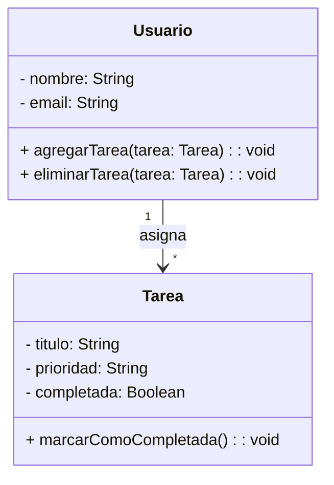

# TaskMaster - Aplicación de Gestión deTareas

## Descripción
TaskMaster es una aplicación diseñada para mejorar la productividad, permitiendo gestionar tareas demanera eficiente. Con esta herramienta, los usuarios pueden organizar sus actividades diarias demanera sencilla y eficaz.
## Características
* :heavy_check_mark: Creación y edición de tareas.
* Asignación de fechas límite y prioridades.
  * Prioridad baja, media y alta.
  * Fechas límite personalizadas con control de calendario.
* :open_file_folder: Organización en categorías y etiquetas.
* :white_check_mark: Marcar tareas como completadas.
* :bell: Notificaciones y recordatorios automáticos.
* :bar_chart: Visualización en lista y tablero Kanban.
## Instalación
Para instalar y ejecutar la aplicación, sigue los siguientes pasos:
```
# Clonar el repositorio
git clone https://github.com/usuario/taskmaster.git
cd taskmaster

# Instalar dependencias
npm install

# Ejecutar la aplicación
npm start
```
## Uso de la API
TaskMaster proporciona una API REST para gestionar tareas. A continuación, un ejemplo de cómocrear una tarea usando **JavaScript**:
```
fetch("https://api.taskmaster.com/tareas",{
  method:"POST",
  headers:{"Content-Type": "application/json" },
  body: JSON.stringify({titulo:"Nueva tarea", prioridad:"Alta"})
})
.then(response=>response.json())
.then(data=>console.log("Tarea creada:",data));
```
## Fórmula de Productividad
La eficiencia del usuario se calcula con la siguiente fórmula:

$$E = \frac{Tareas Completadas}{Tareas Totales}x100$$

Donde:
* $E$ es la eficiencia en porcentaje.
* $Tareas Completadas$ es el número de tareas finalizadas por el usuario.
* $Tareas Totales$ es el número total de tareas asignadas.
## Diagramas de Clases
La siguiente representación en UML muestra la estructura del sistema:


## Capturas de Pantalla
A continuación, una vista previa de la interfaz de usuario:
 
Para registrar una nueva tarea, sigue estos pasos:
1. Haz clic en el botón **Nueva Tarea**.
2. Completa el formulario con los datos de la tarea.
  1. **Título**: Nombre de la tarea.
  2. **Prioridad**: Nivel de importancia (baja, media, alta).
  3. **Fecha Límite**: Día y hora de vencimiento.
3. Haz clic en **Guardar** para crear la tarea.
4. ¡Listo! La tarea se ha registrado correctamente.
